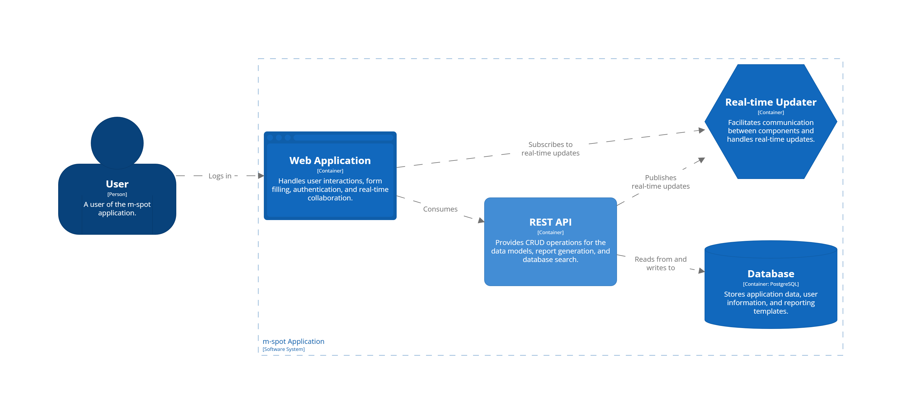
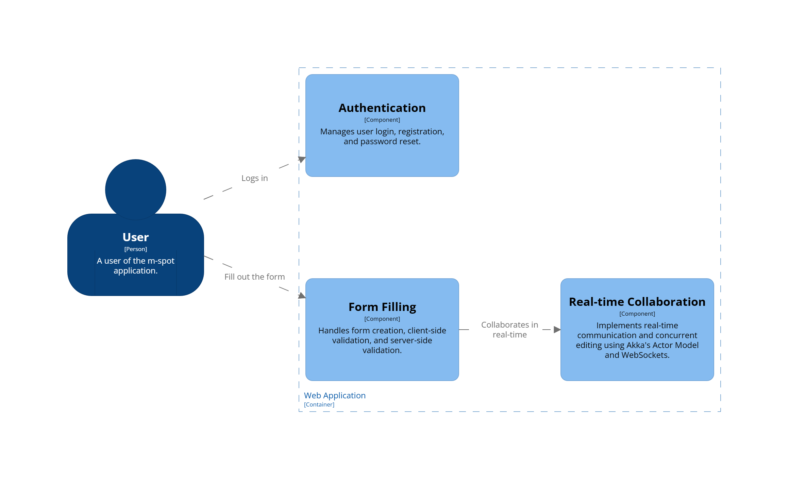
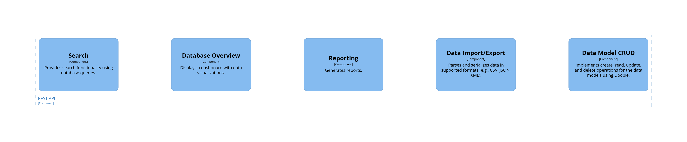

# m-spot
Assistance in keeping order

# Motivation behind the "m-spot" project

## 1. Personal need for organization

The primary motivation behind "m-spot" is the personal need for organization. I struggle with keeping my surroundings neat and tidy, which can lead to increased stress and reduced productivity. "M-spot" aims to solve this problem by providing a simple and intuitive system for keeping track of tools, materials, and other important assets.

## 2. Pet project for personal growth

"M-spot" is also a pet project that offers opportunities for personal growth and development. As a software developer, the project offers me the chance to develop new skills and is a creative outlet for experimenting with new ideas and approaches.

## 3. Focus on simplicity and usability

Finally, "m-spot" is motivated by a focus on simplicity and usability. Many existing organization tools are overly complicated or difficult to use, which can be a barrier to adoption. By keeping the system simple and intuitive, "m-spot" aims to make organization accessible to everyone, regardless of their technical expertise or organizational skills.

# Main features in "m-spot" project
1. A simple search interface to locate an item.
2. Add items in multiple ways, such as manually entering them, uploading files (CSV, JSON), or handwriting for automatic recognition by the system.
3. Easy rearrangement.
4. System options with an in-built feature for real-time collaboration between multiple users.
5. Generate a shopping list based on the current stock levels.

# C4 model
## 1. Container

## 2. Component - Web Application

## 3. Component - REST API

# Real-time cooperation
## 1. Types of cooperation
* Grant Access: administrator allowing a user full access to the document or project.

* First Access Block: user prevents access for editing from other users after the first user has checked edit mode.

* Partial Block: blocking access only to specific sections or areas of the form.

* Non-blocking: allowing multiple users to access and edit the form simultaneously without restrictions.

* Turn-Based Access: restricting access to only one user at a time, allowing each user to take turns editing or making changes to the form.

In every mode, all users get updates on all changes to the form.

## 2. Stack
* Akka Actors
* Akka HTTP
* Akka Streams
* WebSocket
